# Focus Group AI

This is a comprehensive full-stack application built with React, Node.js, and Google Cloud Vertex AI to simulate real-world customer focus groups using synthetic personas. Follow the guide below to set up your environment and run the application locally or deploy it to Google Cloud Run.

## Architecture

```mermaid
graph TD
    User([User Browser]) -->|HTTP / WebSockets| CloudRun[Google Cloud Run: Node.js Express App]
    subgraph Google Cloud Platform
        CloudRun -->|SDK Calls| VertexAI[Vertex AI / Gemini API]
        CloudRun -->|Read/Write Run State & Snapshots| GCS[GCS Bucket: snapshots/ & runs/]
        CloudRun -->|Secrets Retrieval| SecretManager[Secret Manager: GEMINI_API_KEY]
    end
    CloudRun -->|External Review & Media APIs| ExternalSources[External Ingestion: Trustpilot, Steam, YouTube, Web Grounding]
    CloudRun -->|Orchestrates| MultiAgentMesh[Multi-Agent Orchestrator Mesh]
    subgraph Multi-Agent Mesh
        MultiAgentMesh --> IntakeAgent[Intake Agent]
        MultiAgentMesh --> FeasibilityAgent[Feasibility Agent]
        MultiAgentMesh --> PrioritizationAgent[Prioritization Agent]
        MultiAgentMesh --> ResearchAgent[Research Agent]
        MultiAgentMesh --> CreativeAgent[Creative Gen Agent]
        MultiAgentMesh --> PersonalizedExpAgent[Personalized Storefront Experience]
        MultiAgentMesh --> PersonalizeComsAgent[Personalize Coms 1-to-1 Engine]
        MultiAgentMesh --> FullAuditAgent[Full Cross-Pipeline Audit Agent]
        MultiAgentMesh --> CreativeWorkflowAgent[GenMedia Deep Dive Workflow Agent]
        MultiAgentMesh --> ValidationAgent[Validation Agent]
        MultiAgentMesh --> IntegrationAgent[Integration Agent]
        MultiAgentMesh --> JudgeAgent[Judge Agent]
    end
    subgraph Create Content Studio Suite
        A2A_Engine[EA Audience Command Center A2A API] -->|Extract 7 High-Tilt Live Profiles| AudienceService[audienceService.ts / Cache Fallback]
        AudienceService --> ContentMesh[Create Content Hub]
        ContentMesh --> CreativeWorkflowAgent[1. GenMedia Creative Workflow Engine]
        ContentMesh --> PDPPersonalizationAgent[2. Dynamic Box Art & PDP Personalization]
        ContentMesh --> PersonalizedExpAgent[3. Layered Storefront Experience]
        ContentMesh --> PersonalizeComsAgent[4. Personalize Coms 1-to-1 Engine]
        ContentMesh --> CampaignAssetsAgent[5. Multi-Channel Campaign Copy & Asset Flights]

        CreativeWorkflowAgent -->|5-Step Multimodal Engine| CreativeWorkflowUI[Compliance Audit, Persona Scenarios, Aspect Ratios, Versioning & Omni Video]
        PDPPersonalizationAgent -->|Photorealistic Box Art Generation| FlashImage[Gemini 3.1 Flash Lite Image]
        PersonalizedExpAgent -->|Copy & Layout Orchestration| FlashText[Gemini 3.5 Flash Reasoning]
        PersonalizeComsAgent -->|1-to-1 Tailored Dynamic Creative| FlashText
        CampaignAssetsAgent -->|Parallel Copy & Image Generation| FlashImage
    end
    subgraph Insights Intelligence & Audit Suite
        InsightsMesh[Insights Hub Engine] --> InsightsHomeView[1. Home: Google Trends Intel, Regional Country Breakdown, Top Topics & 7-Day Rising Breakouts]
        InsightsMesh --> ListenMesh[2. Listen: Individual & Bulk Research Streams]
        ListenMesh --> RD_Agent[Reddit Intelligence Agent: Threads & Debates]
        ListenMesh --> TT_Agent[TikTok Intelligence Agent: Clips & Sounds]
        ListenMesh --> YT_Agent[YouTube Unified Sentiment: Video & Comments]
        ListenMesh --> STM_Agent[Steam Player Reviews Agent]
        ListenMesh --> TP_Agent[Trustpilot Ratings Agent]
        ListenMesh --> BulkInsightsData[Bulk Research Synthesis & ABCD Scores]
        
        InsightsMesh --> NoiseFilterEngine[3. Filter Pipeline: Raw Ingest, Multi-Worker Noise Filtering & Topics]
        InsightsMesh --> RelGraph[4. Topic Graph: Interactive 60+ Node Network Matrix & Clustering]
        InsightsMesh --> TrajectoryEngine[5. Topic Trajectory: Longitudinal Horizon & FC 27 Strategic Mandates]
        InsightsMesh --> AdOpportunitiesEngine[6. Ad Opportunities: Multi-Threaded In-Game Sponsorship Scanner]
        InsightsMesh --> SummarizeMesh[7. Summarize: Real-Time Alerts, Daily Podcast & Strategic Audit]
        
        SummarizeMesh --> AnomalyEngine[Alerts: Real-Time Sentiment Anomaly Engine]
        SummarizeMesh --> GeminiAudioBrief[Daily Summary: Audio Podcast & Executive Memo]
        SummarizeMesh --> InsightAuditEngine[Insight Audit: 1W/1M/1Y Roadmap & FC28 Go/No-Go]
        
        NoiseFilterEngine -->|Strip Unconstructive Pile-On Negativity| NoiseSignal[Multi-Gen FC 24/FC 25/FC 26/FC 27 Longitudinal Signal Isolation]
        NoiseFilterEngine -->|Extract Granular Topic Taxonomies & Natural Language| TopicsExtract[Stage 3: AI Natural Language Tagging & Discovered Topics]
        RelGraph -->|Feature-Sentiment Co-Occurrence| GraphMatrix[Interactive Visual Network Matrix & Force Nodes]
        TrajectoryEngine -->|Multi-Release Progression & Dedicated GCS File| TrajectoryMandates[Pillar Evolution & FC 27 Actionable Mandates]
        AdOpportunitiesEngine -->|GCS Comments Mining| InGameAds[Dynamic LED Boards, Streetwear Drops & Broadcast Sponsors]

        AnomalyEngine -->|Ground Root-Cause in Multi-Channel Live Feeds| AnomalyBanner[Real Anomaly Alerts, Keyword Cloud & Hotfix Actions]
        GeminiAudioBrief -->|90s Natural Speech Audio| AudioPlayer[Conversational Podcast Player & Drill-Down Workspace]
        FullAuditAgent -->|Synthesize Legal ESRB, Financial Margins & In-Game Drops| AuditUI[Interactive Audit Matrix & In-Game Opportunities]
        InsightsMesh -->|Persist Intelligence Runs & Dedicated Trajectory Checkpoints| GCS
    end
    subgraph GenMedia Creative Workflow Pipeline
        CreativeWorkflowAgent --> S1[1. Upload Core Asset & Brand Compliance Audit]
        CreativeWorkflowAgent --> S2[2. Profile-Driven Persona Scenarios Engine]
        CreativeWorkflowAgent --> S3[3. Multi-Aspect Ratio Adaptation Engine - 3-Thread Parallel Worker]
        CreativeWorkflowAgent --> S4[4. Platform Versioning Engine Switch Xbox PC PS5 Ultimate - 3-Thread Parallel Worker]
        CreativeWorkflowAgent --> S5[5. Gemini 3.5 Flash-Lite Visual Metadata Extraction & Gemini Omni Video Engine]
    end
```



---

## 🚀 Quick Start: Automated GCP Setup & Deploy

The easiest way to configure your Google Cloud Project, enable Vertex AI, set up GCS storage buckets, configure IAM permissions, disable organizational constraints, and deploy the application to Cloud Run is using our automated onboarding wizard:

```bash
chmod +x gcp_setup_deploy.sh
./gcp_setup_deploy.sh
```

This interactive script automates the entire process:
- Authenticates with Google Cloud and verifies billing access.
- Helps you select/create a GCP Project and link billing.
- Enables necessary APIs (Vertex AI, Cloud Run, GCS, Secret Manager).
- Dynamically configures GCS buckets and assigns IAM permissions to build/runtime service accounts.
- Tailors company branding context throughout the codebase.
- Deploys the application live to Cloud Run with public access.

---

**Note:** When first using the application, be sure to run the **Audience Generator** and the **Marketing Brief** tools first. The synthetic Focus Group experience relies on that generated data to provide tailored, persona-driven answers!

## Prerequisites

Before starting, ensure you have the following installed on your machine (Mac or Windows):

1.  **Node.js & npm**: Install the latest LTS version of Node.js from [nodejs.org](https://nodejs.org/). This will include `npm`.
2.  **Google Cloud CLI (gcloud)**: Install the `gcloud` CLI to interact with Google Cloud services.
    -   **Mac**: `brew install --cask google-cloud-sdk` (or download from the Google Cloud docs).
    -   **Windows**: Download the installer from the Google Cloud CLI documentation.

---

## 1. Google Cloud Environment Setup

To use the AI features in this application, you need a Google Cloud Project with the Vertex AI API enabled and proper authentication configured on your local machine.

### Step 1: Create a Google Cloud Project
1.  Go to the [Google Cloud Console](https://console.cloud.google.com/).
2.  Create a new project (or select an existing one).
3.  Note your **Project ID**.

### Step 2: Enable the Vertex AI API
1.  In the Google Cloud Console, navigate to **APIs & Services > Library**.
2.  Search for **Vertex AI API** and click **Enable**.

### Step 3: Authenticate Locally
Open your terminal (Command Prompt/PowerShell on Windows, Terminal on Mac) and authenticate the `gcloud` CLI:

```bash
# Log in to your Google Cloud account
gcloud auth login

# Set your active project
gcloud config set project YOUR_PROJECT_ID

# Set up Application Default Credentials (ADC)
# This is required for the local Node.js server to call Vertex AI!
gcloud auth application-default login
```
*Note: The command `gcloud auth application-default login` will open a browser window for you to authenticate and will generate a local credentials file that the Google Cloud SDKs use automatically.*

---

## 2. Local Application Setup

Once your cloud environment is ready, set up the project locally.

### Step 1: Install Dependencies
Navigate to the root of your project directory and install the required npm packages:

```bash
cd focus-group-app
npm install
```

### Step 2: Verify Configuration
If you copied this from a template, ensure you update any specific configurations:
-   Edit `package.json` if you need to update the `"name"` field.
-   Edit `cloud_run.sh` to update the `SERVICE_NAME` variable if you plan to deploy.

---

## 3. Running the Application Locally

You can start the development server using the provided bash script or standard npm commands.

### Option A: Using the Start Script (Recommended for Mac/Linux)
```bash
./start_local.sh
```

### Option B: Using npm Directly (Windows or Mac)
```bash
npm run dev
```

The development server will be accessible at `http://localhost:3001` (or the production server at `http://localhost:8081` when using `./start_local.sh`). Both ports can be overridden via `VITE_PORT` and `PORT` environment variables.

---

## 4. Deployment to Google Cloud Run

To deploy the application to the internet using Google Cloud Run, follow these steps:

### Step 1: Upload Secrets (One-time Setup)
If your application requires specific API keys (like a Gemini API key for the frontend widget), run the setup script to upload it to Google Cloud Secret Manager:

```bash
./setup_api_key.sh
```
*You will be prompted to enter your API key, which will be securely stored.*

### Step 2: Deploy to Cloud Run
Run the deployment script to build the Docker container and deploy it to Cloud Run:

```bash
./cloud_run.sh
```

Upon successful deployment, the CLI will output a public URL where your application is hosted.