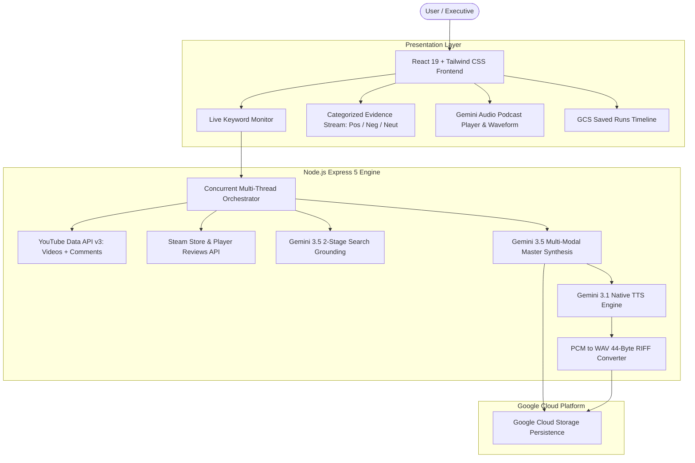

# Developer & Agent Reproduction Guide: Multi-Channel Sentiment Intelligence & Gemini TTS Platform

This guide provides the exact architecture, centralized model registry, model communication patterns, API connectors, and UI component blueprints to reproduce a stripped-down, cloud-native implementation of this application.

---

## 1. Centralized Gemini Model Registry

All model identifiers are centrally managed in `services/geminiService.ts` to ensure consistency and instant model swapping across all agents:

```typescript
export const GEMINI_MODELS = {
    // 1. Pro Tier - Deep Reasoning, Complex Strategy & Multi-Stage Audits
    PRO: 'gemini-3.1-pro',

    // 2. Flash Tier - Fast Multi-Modal Reasoning, Grounded Search & Channel Synthesis
    FLASH: 'gemini-3.5-flash-lite',

    // 3. Flash Lite Tier - Ultra-Fast Persona Simulations, Copy Variations & UI Prompts
    LITE: 'gemini-3.5-flash-lite',

    // 4. Image Generation Tier - Fast Multi-Aspect Ratio Creative Visuals & PDPs
    IMAGE_LITE: 'gemini-3.1-flash-lite-image',

    // 5. Video Generation Tier - Veo 3.1 High-Definition Video Generation
    VIDEO: 'veo-3.1-generate-001',

    // 6. Omni Video Tier - Gemini Omni Multimodal Motion & Video Synthesis
    OMNI_VIDEO: 'gemini-omni-flash-preview',

    // 7. Text-to-Speech Tier - Native Audio & Podcast Synthesis
    TTS: 'gemini-3.1-flash-tts-preview'
} as const;
```

---

## 2. System Architecture



---

## 3. Gemini Model Communication Patterns

Use `@google/genai` (SDK `^1.30.0+`) for all model interactions.

### A. Structured Reasoning & Synthesis (`gemini-3.5-flash-lite` / `gemini-3.1-pro`)
For extracting structured data with strict JSON schemas and optional chain-of-thought thinking:

```typescript
import { GoogleGenAI } from '@google/genai';
import { GEMINI_MODELS } from './services/geminiService';

const ai = new GoogleGenAI({ apiKey: process.env.GEMINI_API_KEY });

export async function synthesizeStructuredData(prompt: string, schema: any) {
  const response = await ai.models.generateContent({
    model: GEMINI_MODELS.FLASH, // 'gemini-3.5-flash-lite'
    contents: [{ role: 'user', parts: [{ text: prompt }] }],
    config: {
      responseMimeType: 'application/json',
      temperature: 0.2,
      thinkingConfig: { thinkingLevel: 'HIGH' } // Supported in Gemini 3.x
    }
  });

  const text = response.candidates?.[0]?.content?.parts?.[0]?.text || '{}';
  return JSON.parse(text);
}
```

---

### B. Dual-Stage Google Search Grounding (`gemini-3.5-flash-lite`)
Never run search grounding directly in JSON mode. Split into 2 stages to capture both raw text insights and verified web citation URLs:

```typescript
export async function runTwoStageGrounding(query: string, companyName: string) {
  // Stage 1: Plain text search grounding with Google Search Tool
  const searchResponse = await ai.models.generateContent({
    model: GEMINI_MODELS.FLASH, // 'gemini-3.5-flash-lite'
    contents: [{ 
      role: 'user', 
      parts: [{ text: `Search live real-world news from the LAST 7 DAYS for: "${query}" (${companyName}). Identify positive trends and critical friction points.` }] 
    }],
    config: {
      temperature: 0.2,
      tools: [{ googleSearch: {} }]
    }
  });

  const rawResearchText = searchResponse.candidates?.[0]?.content?.parts?.[0]?.text || '';
  
  // Extract verified grounding links from metadata
  const metadata = searchResponse.candidates?.[0]?.groundingMetadata;
  const rawGroundedLinks = (metadata?.groundingChunks || [])
    .filter((c: any) => c.web?.uri)
    .map((c: any) => ({ uri: c.web.uri, title: c.web.title || 'Web Source' }));

  // Stage 2: Transform research into JSON and map verified URLs
  const jsonResponse = await ai.models.generateContent({
    model: GEMINI_MODELS.FLASH, // 'gemini-3.5-flash-lite'
    contents: [{
      role: 'user',
      parts: [{
        text: `
Transform the grounded research into structured alerts:
RESEARCH TEXT:
${rawResearchText}

AVAILABLE VERIFIED SOURCES:
${JSON.stringify(rawGroundedLinks)}

Schema:
{
  "alerts": [
    { "title": "Headline", "summary": "1-2 sentences", "severity": "favorable|critical|warning", "url": "URL_FROM_SOURCES" }
  ]
}
`
      }]
    }],
    config: {
      responseMimeType: 'application/json',
      temperature: 0.1
    }
  });

  return JSON.parse(jsonResponse.candidates?.[0]?.content?.parts?.[0]?.text || '{"alerts":[]}');
}
```

---

### C. Native Gemini Text-to-Speech (TTS) & PCM -> WAV Conversion
Generate 1.5-min executive audio briefings using `responseModalities: ['audio']` and prebuilt voices (`Zephyr`, `Puck`, `Charon`, `Kore`, `Fenrir`):

```javascript
// Backend endpoint: server.js
app.post('/api/tts/generate-podcast', async (req, res) => {
  const { text, voiceName = 'Zephyr' } = req.body;

  const response = await ai.models.generateContent({
    model: 'gemini-3.1-flash-tts-preview',
    config: {
      temperature: 1,
      responseModalities: ['audio'],
      speechConfig: {
        voiceConfig: {
          prebuiltVoiceConfig: { voiceName }
        }
      }
    },
    contents: [{ role: 'user', parts: [{ text: `## Transcript:\n${text}` }] }]
  });

  const inlineData = response.candidates?.[0]?.content?.parts?.[0]?.inlineData;
  if (inlineData?.data) {
    const wavBuffer = convertPcmToWav(inlineData.data, inlineData.mimeType || 'audio/pcm;rate=24000');
    const audioUrl = `data:audio/wav;base64,${wavBuffer.toString('base64')}`;
    return res.json({ success: true, audioUrl, durationSeconds: 90, voiceName });
  }

  res.status(500).json({ error: 'TTS generation failed' });
});

// Helper: 44-Byte RIFF/WAV Header Builder
function convertPcmToWav(rawDataBase64, mimeType = 'audio/pcm;rate=24000') {
  const rawBuffer = Buffer.from(rawDataBase64, 'base64');
  let sampleRate = 24000;
  
  if (mimeType.includes('rate=')) {
    const match = mimeType.match(/rate=(\d+)/);
    if (match) sampleRate = parseInt(match[1], 10);
  }

  const numChannels = 1;
  const bitsPerSample = 16;
  const byteRate = (sampleRate * numChannels * bitsPerSample) / 8;
  const blockAlign = (numChannels * bitsPerSample) / 8;
  const dataLength = rawBuffer.length;

  const header = Buffer.alloc(44);
  header.write('RIFF', 0);
  header.writeUInt32LE(36 + dataLength, 4);
  header.write('WAVE', 8);
  header.write('fmt ', 12);
  header.writeUInt32LE(16, 16);
  header.writeUInt16LE(1, 20); // PCM Format
  header.writeUInt16LE(numChannels, 22);
  header.writeUInt32LE(sampleRate, 24);
  header.writeUInt32LE(byteRate, 28);
  header.writeUInt16LE(blockAlign, 32);
  header.writeUInt16LE(bitsPerSample, 34);
  header.write('data', 36);
  header.writeUInt32LE(dataLength, 40);

  return Buffer.concat([header, rawBuffer]);
}
```

---

### D. Creative Image Generation (`gemini-3.1-flash-lite-image`)
For creating multi-aspect ratio promotional visuals and localized packshots:

```typescript
export async function generatePackshotVisual(prompt: string, referenceImageBase64?: string) {
  const response = await ai.models.generateContent({
    model: GEMINI_MODELS.IMAGE_LITE, // 'gemini-3.1-flash-lite-image'
    contents: referenceImageBase64 ? [
      { role: 'user', parts: [
        { inlineData: { mimeType: 'image/png', data: referenceImageBase64 } },
        { text: prompt }
      ]}
    ] : [
      { role: 'user', parts: [{ text: prompt }] }
    ],
    config: {
      imageConfig: {
        aspectRatio: '16:9'
      }
    }
  });

  const part = response.candidates?.[0]?.content?.parts?.[0];
  return part?.inlineData?.data ? `data:image/png;base64,${part.inlineData.data}` : null;
}
```

---

## 4. Live API Connectors (Zero Mock Data)

### YouTube Data API v3
```javascript
// 1. Search 7-Day Targeted Videos
const ytSearch = await fetch(`https://www.googleapis.com/youtube/v3/search?part=snippet&type=video&maxResults=3&q=${encodeURIComponent(query)}&publishedAfter=${sevenDaysAgoIso}&order=relevance&key=${API_KEY}`);

// 2. Fetch Verified Comments (up to 50 per video)
const ytComments = await fetch(`https://www.googleapis.com/youtube/v3/commentThreads?part=snippet&videoId=${videoId}&maxResults=50&textFormat=plainText&key=${API_KEY}`);
```

### Steam Store & Reviews API
```javascript
// 1. Search App ID
const steamSearch = await fetch(`https://store.steampowered.com/api/storesearch/?term=${encodeURIComponent(keyword)}&l=english&cc=US`);

// 2. Ingest 30-Day Verified Purchaser Reviews
const steamReviews = await fetch(`https://store.steampowered.com/appreviews/${appId}?json=1&filter=recent&num_per_page=50&cursor=*&day_range=30`);
```

---

## 5. UI Architecture & Design Blueprint

Adhere strictly to **Zinsser's principles**: Simplicity, Brevity, Clarity, and Humanity.

```
+-------------------------------------------------------------------------+
| [⚡ Live Keyword Monitor] [Search Keyword: "FC 26"] [Refresh Data]       |
| Saved Results: [#FC 26 • 1:12 PM] [#Gameplay • 12:45 PM]                |
+-------------------------------------------------------------------------+
| [======== Multi-Thread Progress Bar (100% Complete) ===================] |
| [1. Grounded 7-Day: Done] [2. Steam 30-Day: Done] [3. YouTube: Done]    |
+-------------------------------------------------------------------------+
| EXECUTIVE DIAGNOSTIC: 78% Positive Sentiment • Severity 22/100         |
| Root Cause: Core passing mechanics praised; Evolution grind friction.  |
| Mitigations: [Deploy Hotfix Tuning] [Publish Developer Update]          |
+-------------------------------------------------------------------------+
| DAILY SUMMARY 90s PODCAST: [Play ▶] [Voice: Zephyr ▼] [1.0x] [Mute]     |
| [ |||||||||||||||||||| Animated Waveform Visualizer ||||||||||||||||| ] |
| Transcript: "Good morning, EA Marketing. Over the last 7 days..."      |
+-------------------------------------------------------------------------+
| YOUTUBE CREATOR VIDEO BREAKDOWN (3 Videos Analyzed):                    |
| +--------------------+ +--------------------+ +--------------------+   |
| | Video 1 (Positive) | | Video 2 (Critical) | | Video 3 (Trending) |   |
| | Score: 86% | Com: 72%| | Score: 38% | Com: 30%| | Score: 78% | Com: 64%|   |
| | Alignment: Aligned | | Alignment: Mixed   | | Alignment: Aligned |   |
| +--------------------+ +--------------------+ +--------------------+   |
+-------------------------------------------------------------------------+
| MULTI-CHANNEL EVIDENCE STREAM:                                          |
| Filters: [All (120)] [Positive (84)] [Critical (26)] [Neutral (10)]     |
| Channels: [All Channels] [YouTube Comments] [Steam Reviews] [News]      |
| +---------------------------------------------------------------------+ |
| | [YouTube Reviewer] "The new ball physics feel crisp!" [Positive]   | |
| | [Steam Verified (140 hrs)] "Server lag during weekend league" [Neg] | |
| +---------------------------------------------------------------------+ |
+-------------------------------------------------------------------------+
```

---

## 6. Persistence Pattern (Google Cloud Storage)

Every run must be dual-saved to GCS under the active tenant folder:
1. `gs://${BUCKET}/${companyName}/runs/${featureId}_run.json` (Active Cache).
2. `gs://${BUCKET}/${companyName}/runs/${featureId}_history.json` (Indexed Run History).
3. `gs://${BUCKET}/${companyName}/runs/daily_summary_run.json` (Syncs podcast audio & talk track).

---

## 7. Containerization & Production Build Standard

### `.dockerignore`
```
node_modules
npm-debug.log
.git
.DS_Store
dist
build
```

### `Dockerfile`
```dockerfile
FROM node:20-alpine
WORKDIR /app
COPY package*.json ./
RUN npm install
COPY . .
RUN rm -rf node_modules && npm install && npm run build
EXPOSE 8080
CMD ["node", "server.js"]
```
