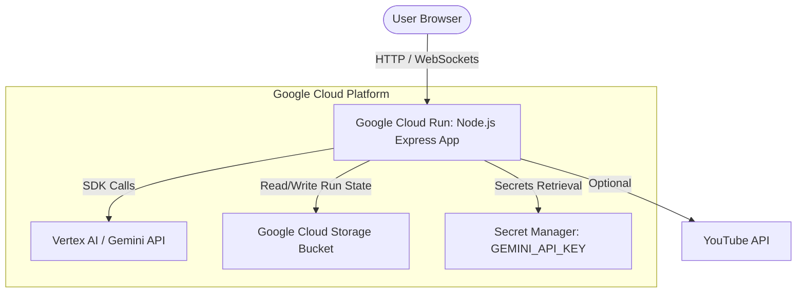

# Implementation Plan: Automated GCP Project Setup & Deployment Script

This plan details the technical approach to creating a master onboarding and deployment script (`gcp_setup_deploy.sh`) for the Focus Group AI/AI Lab application, refactoring bucket configuration, and documenting the architecture.

## 1. Architectural Changes (Phase 0)
Add a Mermaid architecture diagram to `README.md` to illustrate the data flow between the React frontend, Node.js backend, and the various GCP services.

## 2. Refactoring GCS Bucket Configuration
Currently, `server.js` hardcodes the GCS bucket name as `'ailab-gcs'`. Since GCS bucket names are globally unique, a new GCP project cannot reuse this exact bucket name.
* **Solution**: Change `server.js` to look for a `GCS_BUCKET_NAME` environment variable, defaulting to `'ailab-gcs'` if not set.
* **Implementation**: Define a helper `getBucketName()` in `server.js` and update all GCS storage calls.

## 3. The Onboarding Wizard Script (`gcp_setup_deploy.sh`)
We will create a shell script that performs the following steps:

### Phase A: Authentication Verification
1. Verify if the user is authenticated with `gcloud`. If not, run `gcloud auth login`.
2. Check for Application Default Credentials (ADC) by verifying the credentials file or running `gcloud auth application-default login`.

### Phase B: User Inputs
1. **GCP Project ID**: Prompt the user to enter the desired GCP Project ID.
2. **Customer/Company Name**: Prompt the user to enter the customer/company name (e.g., `StateFarm`, `Target`, `Aetna`).
3. **Gemini API Key**: Prompt for the API key to be stored in Secret Manager.
4. **GCP Region**: Prompt for the deployment region (default: `us-central1`).

### Phase C: Google Cloud Platform Setup
1. **Project Creation**: Check if the project exists. If not, create it.
2. **Active Project Association**: Set `gcloud config set project <PROJECT_ID>`.
3. **API Enablement**: Enable:
   - `aiplatform.googleapis.com` (Vertex AI)
   - `run.googleapis.com` (Cloud Run)
   - `artifactregistry.googleapis.com` (Artifact Registry)
   - `cloudbuild.googleapis.com` (Cloud Build)
   - `storage.googleapis.com` (Google Cloud Storage)
   - `secretmanager.googleapis.com` (Secret Manager)
4. **GCS Bucket Creation**: Create a bucket named `<PROJECT_ID>-ailab-gcs` using `gcloud storage buckets create`.
5. **Secret Manager configuration**: Create `GEMINI_API_KEY` secret and add the secret version containing the user's API key.
6. **IAM Policy Configuration**: Grant `roles/secretmanager.secretAccessor` to the default Compute Engine service account so Cloud Run can access the key.

### Phase D: Local Codebase Modification
1. **Config Update**:
   - Update `companyName` inside `config.ts` to the new Customer Name.
   - Update `branding.companyName` inside `public/data/configuration/app_config.json` to the new Customer Name.
2. **Deployment Config Update**:
   - Update `SERVICE_NAME` inside `cloud_run.sh` to match the customer/company name slug (e.g. `statefarm-app`).

### Phase E: Application Deployment
1. Build the frontend and deploy to Google Cloud Run by invoking the updated `cloud_run.sh` script, dynamically passing the `GCS_BUCKET_NAME` environment variable.

---

## 4. Proposed File Changes

### [config.ts](file:///Users/curtisgross/Documents/github/marking-ailab-branch/config.ts)
* Modify `companyName` to the new value.

### [public/data/configuration/app_config.json](file:///Users/curtisgross/Documents/github/marking-ailab-branch/public/data/configuration/app_config.json)
* Modify `branding.companyName` to the new value.

### [cloud_run.sh](file:///Users/curtisgross/Documents/github/marking-ailab-branch/cloud_run.sh)
* Update `SERVICE_NAME` to the new name.
* Add `--set-env-vars=GCS_BUCKET_NAME=$GCS_BUCKET_NAME` to `gcloud run deploy` command.

### [server.js](file:///Users/curtisgross/Documents/github/marking-ailab-branch/server.js)
* Add `getBucketName()` function.
* Replace `'ailab-gcs'` with `getBucketName()`.

### `gcp_setup_deploy.sh` (New File)
* Create the master setup and deployment wizard script.

---

## 5. Potential Risks & Mitigations
* **Billing Account Linkage**: Project creation via CLI requires a billing account for some paid services (like Vertex AI models and Cloud Run). The script will check if billing is enabled or display clear instructions on how the user can link a billing account if creation/deployment fails.
* **Secret Versioning / Permissions**: If the service account doesn't have secret access, the Cloud Run instance will crash at boot. The script automatically resolves this by resolving the project number and adding IAM binding.
