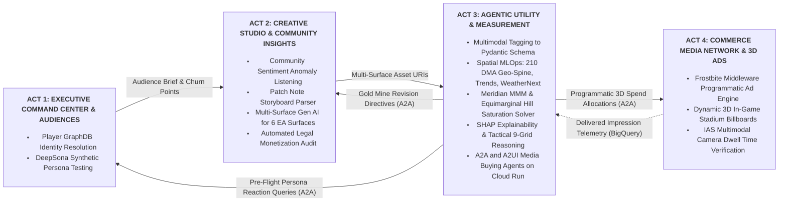

# Electronic Arts (EA) Executive Briefing Center (EBC) AI Solutions
## Unified Closed-Loop Monorepo Architecture (`ea-ebc-demos`)

Welcome to the central repository for the Google Cloud AI Transformation (CAiT) demonstration platform built for the **Electronic Arts Executive Briefing Center (August 2026)**.

This repository is organized as a **monorepo** housing four interconnected AI applications. Together, they demonstrate a unified, closed-loop growth engine: from sentiment detection and player identity resolution to multi-surface content generation, predictive measurement, agentic media buying, and dynamic 3D in-game monetization.

---

## 1. Unified Ecosystem Architecture & Flow Map



---

## 2. Monorepo Directory Structure

```text
/ea-ebc-demos/
├── 00-data-foundation/       # Unified Synthetic Data Engine (BQML AI.GENERATE_TABLE, 3-Yr MMM, Geo-Spine)
│
├── 01-audiences/             # Jamie Pourturk (Act 1: Command Center, Player Graph & DeepSona)
│
├── 02-creative-insights/     # Curtis Gross (Act 2: Creative Studio & Community Insights)
│
├── 03-measurement/           # Pat Grady (Act 3: Creative Intelligence & Agentic Measurement)
│
├── 04-commerce-media/        # Surya Kunju (Act 4: EA Commerce Media Network & 3D Ads)
│
├── DATA-STRATEGY.md          # Synthetic Data Foundation & Analytical Architecture
├── MACRO-CONCEPT.md          # Full Executive Narrative & Presenter Run-of-Show Scripts
├── REFACTOR_1_REQUIREMENTS.md # Track Partitioning Specifications
└── README.md                 # System Root Documentation
```

---

## 3. The 4-Act Connected Narrative

| Act | Module | Presenter | EBC Session | Target EA Stakeholders | Core Narrative |
| :--- | :--- | :--- | :--- | :--- | :--- |
| **Act 1** | `01-audiences` | Jamie Pourturk | Audiences: The Foundation (11:00 AM) | Brian Baron, Christina Bumbaca, Joel Knutson | Shifting "From Who to Why" by activating the Player Graph and pre-testing battle passes with synthetic personas. |
| **Act 2** | `02-creative-insights` | Curtis Gross | Creative: Multi-Agent Content Creation (1:45 PM) | Andrea Hopelain, Julie Foster, Evan Dexter | Turning patch notes and sentiment spikes into localized, brand-compliant creative across EA's 6 surfaces. |
| **Act 3** | `03-measurement` | Pat Grady | Agentic Utility & Measurement (12:45 PM) | Brian Baron, Christina Bumbaca, Gabi De Rossi | Connecting creative game mechanics to CPI and D7 ROAS using Meridian MMM and SHAP 9-grid reasoning. |
| **Act 4** | `04-commerce-media` | Surya Kunju | RMN: Identity & Data Partnerships (3:30 PM) | Andrea Hopelain, Evan Dexter, Mark Cole | Turning gameplay surfaces into a programmatic, brand-safe Commerce Media Network with IAS camera dwell scoring. |

---

## 4. Synthetic Data Foundation & Seeding Quickstart

All four demo tracks are powered by the unified data foundation in [`00-data-foundation/`](00-data-foundation/):

```bash
# 1. Execute the 5-step synthetic data generation pipeline against BigQuery & Firestore
python3 00-data-foundation/orchestrator.py --live

# 2. Seed Firestore Native collections (/campaigns, /creative_assets, /scenarios)
python3 03-measurement/scripts/seed_firestore_and_bq.py --live

# 3. Run full automated test suite across all modules
PYTHONPATH="03-measurement:00-data-foundation" ./03-measurement/.venv/bin/pytest 03-measurement/tests 03-measurement/agents/tests 00-data-foundation/tests
```

---

## 5. Contact & Track Owners

* **`01-audiences`**: Jamie Pourturk (`jlpourt@google.com`)
* **`02-creative-insights`**: Curtis Gross (`curtisgross@google.com`)
* **`03-measurement`**: Pat Grady (`patrickgrady@google.com`)
* **`04-commerce-media`**: Surya Kunju (`suryakunju@google.com`)
